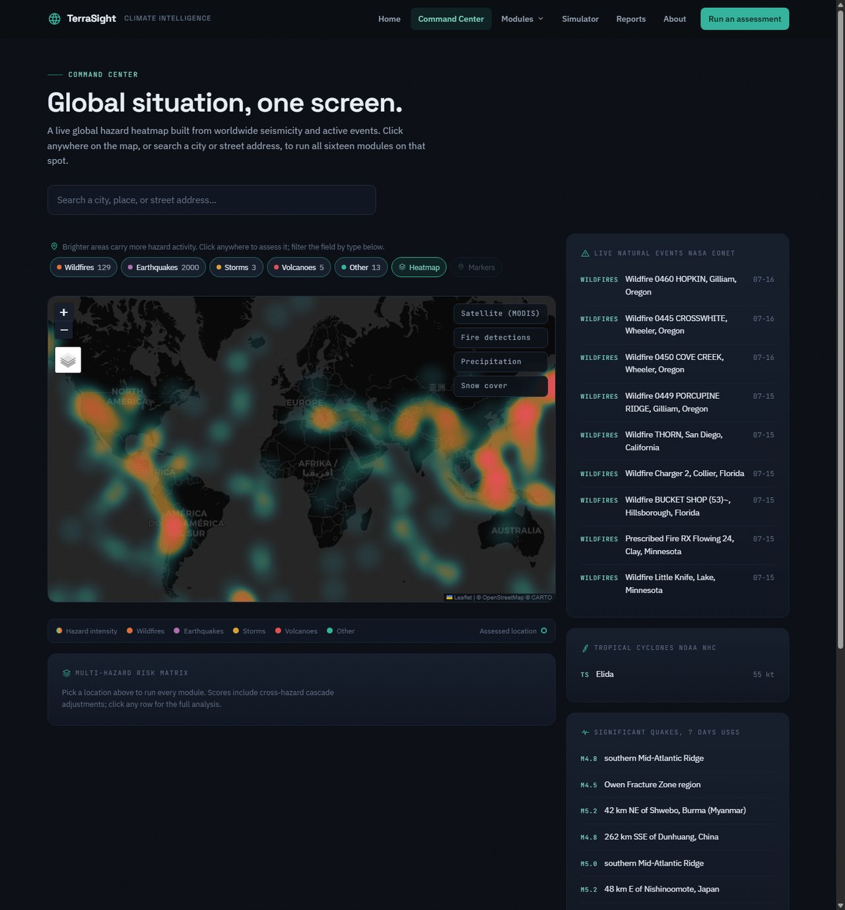
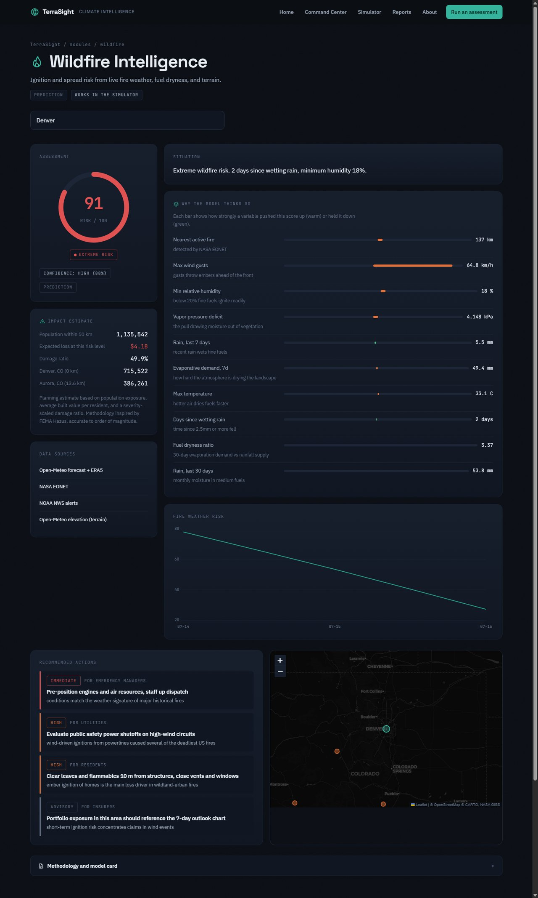
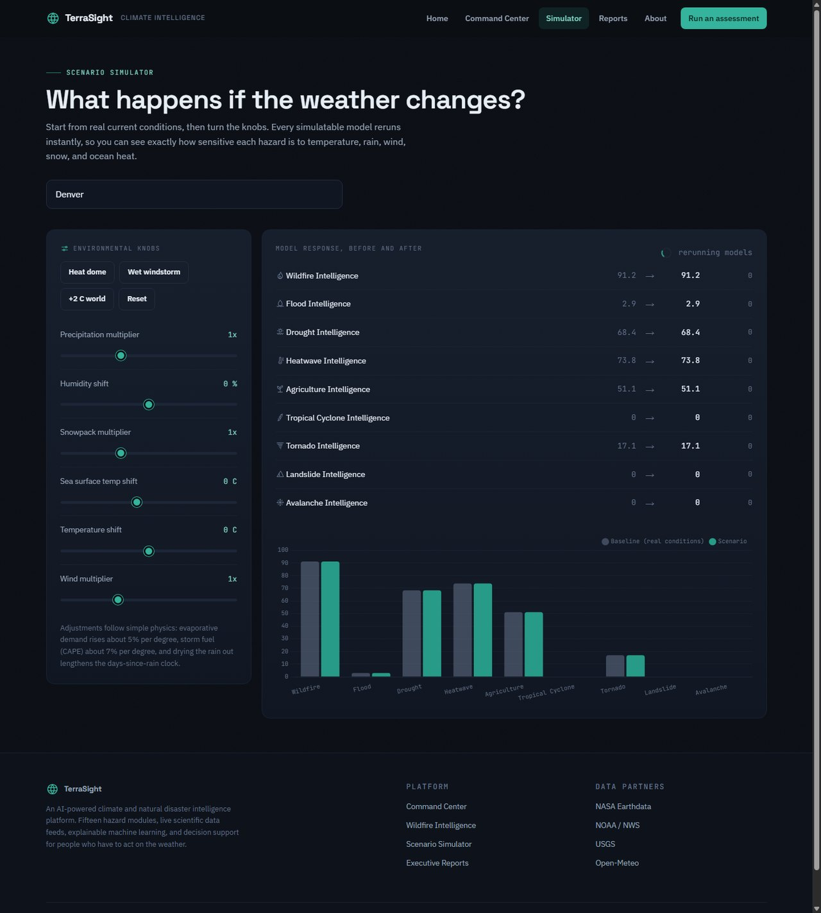
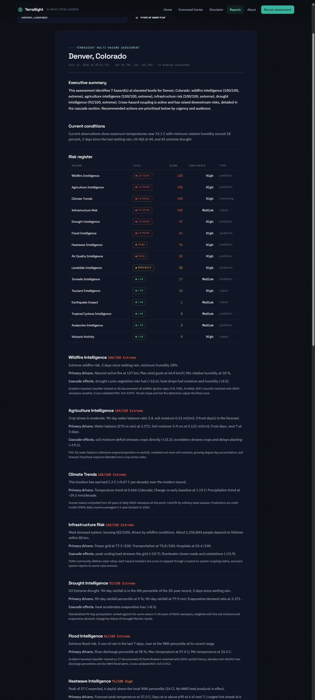

# TerraSight, Climate and Natural Disaster Intelligence Platform

TerraSight is an AI-powered decision support system for climate and geophysical hazards. It is a full intelligence platform: sixteen hazard modules, live scientific data feeds, machine learning trained on real historical disasters, cross-hazard cascade modeling, a scenario simulator, economic impact analysis, and auto-generated executive reports.

It is built for the kinds of users who have to act on the weather: residents, researchers, emergency managers, utilities, farmers, insurers, and planners.

## Screenshots

**Command Center** — a live global hazard heatmap (built from worldwide seismicity and active events) you can click anywhere to assess, with disaster-type filters, NASA GIBS science layers, live event feeds, and the run-all risk matrix. Search accepts city names or full street addresses:



**Module page** — every module shows a risk gauge, an explainability panel, impact estimate, forecast timeline, a live map, and role-targeted recommendations:



**Scenario Simulator** — start from real conditions, turn the knobs, and watch every model rerun:



**Executive Report** — a full multi-hazard situation report, print-ready:



## Why it exists

Two years ago a wildfire broke out an hour from my community. The air was thick with smoke for days and my family packed bags we hoped we would not need. The LA fires that followed made the lesson permanent. I started with a single wildfire model, then kept going: no hazard exists alone, and nobody should have to interpret a raw risk score during an emergency.

## The sixteen intelligence modules

| Module | Type | What it does |
|---|---|---|
| Wildfire Intelligence | prediction | ML ignition risk from live fire weather, fuel dryness, terrain, live fire detections, and Red Flag Warnings |
| Flood Intelligence | prediction | ML rainfall-flood probability blended with GloFAS river discharge percentiles, USGS gauges, and NWS flood alerts |
| Drought Intelligence | prediction | 90-day precipitation ranked against a 30-year local baseline, soil moisture, evaporative demand, US Drought Monitor style categories |
| Air Quality Intelligence | prediction | Live PM2.5, ozone, and US AQI from the Copernicus CAMS model with a 4-day outlook and wildfire smoke attribution |
| Heatwave Intelligence | prediction | Forecast temperatures ranked against local same-season percentiles, plus warm-night mortality signals, with an absolute-threshold fallback |
| Winter Storm Intelligence | prediction | Snowfall accumulation, freezing-rain ice risk, NWS wind chill, and blizzard criteria from the live forecast |
| Agriculture Intelligence | prediction | FAO-56 water balance, growing degree days, soil moisture, frost and heat stress for crops |
| Climate Trends | monitoring | Warming trend since the 1990s from ERA5 and CMIP6 projections to 2050 for any point on Earth |
| Infrastructure Risk | impact | FEMA lifelines style rollup: how current hazards stress power, transport, hospitals, water, and housing |
| Tropical Cyclone Intelligence | prediction | Live NHC storm tracking, Rankine wind field estimates at your location, sea surface temperature as fuel |
| Tornado Intelligence | prediction | Convective assessment combining CAPE with deep-layer wind shear (supercell composite logic), overridden by live NWS watches and warnings |
| Tsunami Intelligence | impact | Coastal exposure from elevation and shore proximity plus regional undersea seismicity and live tsunami messages |
| Landslide Intelligence | prediction | Caine (1980) rainfall intensity-duration thresholds weighted by slope, antecedent moisture, burn scars, and recent quakes |
| Avalanche Intelligence | prediction | New snow loading, wind slab, rapid warming, and rain-on-snow signals gated by snowpack depth and slope |
| Volcanic Activity | impact | Live USGS alert levels for every monitored US volcano, seismic unrest detection, ashfall guidance |
| Earthquake Impact | impact | Real 50-year seismicity rates (Gutenberg-Richter), shaking attenuation, Omori aftershock probabilities, loss modeling |

Modules marked impact are honestly framed: science cannot predict earthquakes, tsunamis, or eruptions, so those modules model exposure, readiness, and consequences instead of pretending to forecast the event. Each module page says which kind it is next to the score.

## What makes it different

- Real data only. Every number traces to a live or historical feed from NASA, NOAA, USGS, or Open-Meteo. There is no synthetic or manually entered data anywhere in the pipeline.
- ML trained on real disasters. The wildfire model is trained on 80 documented US wildfire ignition days (Camp Fire, Dixie, Marshall, Palisades, and others from CAL FIRE, InciWeb, and NIFC records) matched with ERA5 reanalysis weather. The flood model is trained on 37 documented US flood disasters. Cross-validated ROC AUC is 0.875 for wildfire and 0.912 for flood.
- Physics-constrained models. Both classifiers use monotonic constraints, so more wind can never mean less fire and more rain can never mean more drought. The constraints also improved cross-validated accuracy.
- Explainable everywhere. Every score ships with per-variable contributions (occlusion analysis against training medians), a confidence label, and a full model card.
- Cascading hazards. Twenty-two documented couplings connect the modules: drought primes wildfire, hurricanes drive flood and outages, quakes raise tsunami and landslide risk, winter storms load avalanche terrain, eruptions degrade air quality. When one score rises, downstream scores update.
- Scenario simulation. Load real current conditions for any location, then shift temperature, precipitation, wind, humidity, snowpack, or sea surface temperature and watch every model rerun. Answers questions like "what if rainfall doubles" or "what does plus 2 degrees do here".
- Executive reports. One click produces a professional multi-hazard situation report: summary, conditions, risk register, per-hazard analysis, cascade interactions, prioritized actions by audience, economic exposure, and data provenance. Print-ready.
- Economic impact. Population exposure from real census figures plus severity-scaled damage ratios in the spirit of FEMA Hazus, labeled clearly as order-of-magnitude planning estimates.

## Data sources

All feeds are free, and no API key is required for anything.

| Provider | Feeds used |
|---|---|
| Open-Meteo | Weather forecast, ERA5 reanalysis back to 1940, CAMS air quality, GloFAS river discharge, CMIP6 climate projections, marine conditions, elevation, geocoding |
| USGS | Live and 50-year earthquake catalogs, NWIS river gauges, Volcano Hazards Program alert levels |
| NOAA | National Weather Service active alerts, National Hurricane Center storm feed |
| NASA | EONET natural event tracker, GIBS satellite tile layers, FIRMS fire detections (optional key enables VIIRS detail) |

Optional: set `FIRMS_MAP_KEY` (free from NASA FIRMS) for point-level VIIRS fire detections. Without it the platform falls back to NASA EONET wildfire events automatically.

## Running locally

Requirements: Python 3.11 or newer.

```bash
git clone https://github.com/BoyTiger-1/wildfire-web-app.git
cd wildfire-web-app
pip install -r requirements.txt
python main.py
```

Open http://localhost:5000. The first assessment on a new location takes 10 to 60 seconds while live feeds are pulled; repeat runs are fast because responses are cached.

### Retraining the models

Trained models ship in `src/ml/models/`. To retrain from scratch against the real event catalogs (about 500 ERA5 fetches, 10 to 15 minutes):

```bash
python -m src.ml.train
```

This regenerates the model files and their model cards, including cross-validated metrics.

## Pages

- `/` platform homepage with live global event counts
- `/dashboard` command center: live global disaster map with a density heatmap, disaster-type filters, NASA GIBS layers, live EONET, NHC, and USGS feeds, and the run-all risk matrix
- `/module/<slug>` any of the sixteen module pages, for example `/module/wildfire`
- `/simulator` scenario simulator
- `/reports` executive report generator
- `/about` project story and methodology overview

Tool pages accept `?lat=&lon=&name=` query parameters, so assessments are shareable links.

## API

All endpoints return JSON.

| Endpoint | Description |
|---|---|
| `GET /api/geocode?q=denver` | Location search, understands both city names and full street addresses |
| `GET /api/reverse-geocode?lat=..&lon=..` | Turn a clicked map point into a place name |
| `GET /api/assess/<module>?lat=..&lon=..` | Run one module, for example `/api/assess/wildfire` |
| `GET /api/assess-all?lat=..&lon=..` | Run all sixteen modules plus cascade coupling |
| `GET /api/report?lat=..&lon=..` | Full executive report |
| `GET /api/scenario/knobs` | Available simulator adjustments |
| `POST /api/scenario/run` | Body `{lat, lon, deltas}`, returns before and after scores |
| `GET /api/live/overview` | Global live events, storms, and significant quakes |
| `GET /api/live/heatmap` | Dense worldwide weighted points for the global hazard heatmap |
| `POST /api/wildfire/predict` | Legacy wildfire endpoint, same contract as the original app, now backed by the real-data model |
| `POST /api/wildfire/predict-manual` | Legacy manual-input endpoint, kept for backward compatibility |

## Architecture

```
main.py                  Flask app and page routes
src/
  config.py              API endpoints and shared constants
  http_client.py         cached HTTP layer for all upstream feeds
  services/              Open-Meteo, USGS, NOAA, NASA clients
  data/                  real event catalogs and reference data
    fire_history.py        80 documented US wildfire ignitions
    flood_history.py       37 documented US flood disasters
    cities.py              120 largest US cities, 2020 census populations
    volcano_coords.py      Smithsonian GVP coordinates for monitored volcanoes
  ml/
    features.py          feature engineering shared by training and inference
    train.py             training pipeline against the real event catalogs
    registry.py          model loading, prediction, occlusion explanations
    models/              trained models and model cards
  modules/               the sixteen intelligence modules plus shared helpers
  analysis/
    cascades.py          cross-hazard coupling engine
    scenario.py          what-if simulator
    reports.py           executive report generator
    economics.py         population exposure and loss estimates
  routes/                REST API blueprints
templates/  static/      frontend pages, design system, page scripts
```

## Honest limitations

- Economic figures are planning estimates, accurate to order of magnitude, not underwriting values.
- The training catalogs are US-heavy, so ML scores are best calibrated for North America. The index-based modules are global.
- NWS alerts, USGS river gauges, and USGS volcano alert levels only cover the United States; the platform degrades gracefully elsewhere.
- TerraSight is a decision-support and education tool, not an official warning source. In an emergency, follow your local authorities.

## Deployment

`render.yaml` deploys the platform on Render with gunicorn. Set `FIRMS_MAP_KEY` in the environment if you have one. A `SECRET_KEY` is generated automatically.
